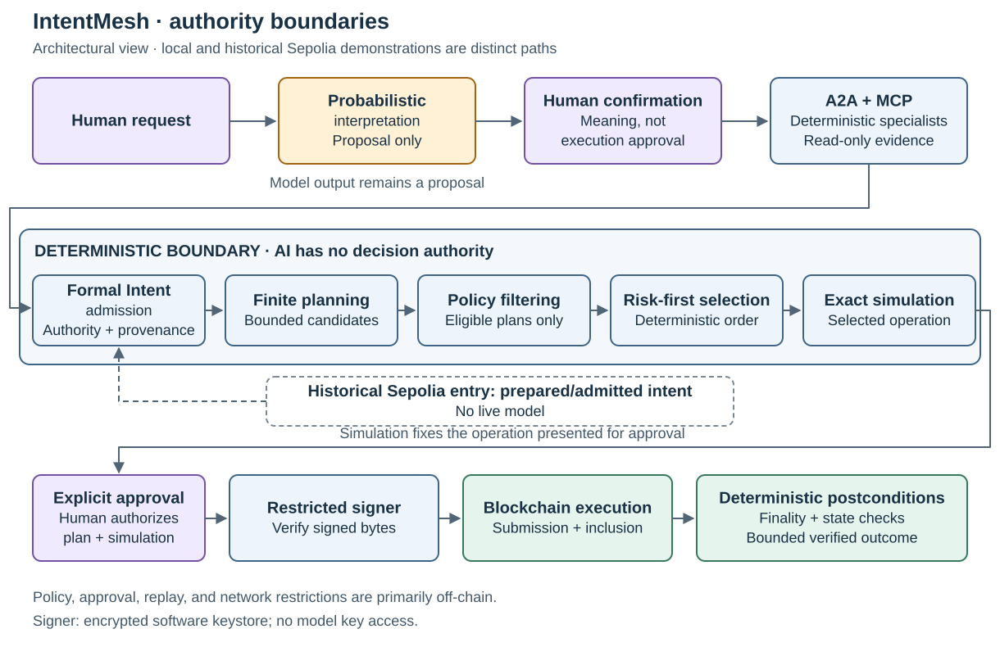

# IntentMesh

IntentMesh is a reference architecture for turning a human request into a constrained, explicitly authorized transaction, with a deterministic boundary between semantic interpretation and execution.

**Gabriele Soranzo** · Enterprise / Solution Architect

The public demonstration is **synthetic, on Ethereum Sepolia, and limited to one bounded same-chain lending deposit workflow**. It begins with a prepared, admitted intent. No live model participated in this public run. It is an experimental proof of concept, not a production system, with no real-fund or mainnet execution.

**AI interprets intent; deterministic systems enforce constraints; the user authorizes execution.**

A natural-language request leaves consequential questions unresolved: which asset, whose account, what exact amount, which acceptable venue, what risk limit, and what counts as success? A plausible model response cannot settle those questions by itself. IntentMesh explores how to retain semantic assistance while giving financial constraints, plan selection, signing, and outcome verification explicit owners and inspectable rules.

The design makes the authority transition a concrete admission boundary. Proposals and validated evidence enter; a deterministically admitted Formal Intent leaves.

**What was demonstrated**

On September 5, 2026, the historical Sepolia workflow recorded four synthetic contract instances: an imUSDC token, Alpha and Beta vaults, and a shared position token. Eight transactions deployed and configured them. Two subsequent transactions approved an exact finite allowance and deposited **10,000 imUSDC into Alpha**. With six decimals, that principal is exactly 10,000,000,000 smallest units.

The complete record contains ten transactions, four deployed runtime bytecode checks, and thirteen state checks at a common finalized block. The finality evidence records agreement between two RPC sources. The public trace records the path from the controlled admitted intent through finalized postconditions.

| Public proof | Inspect |
|---|---|
| Exact finite allowance | [Sepolia transaction](https://sepolia.etherscan.io/tx/0xfe6d0025aa9e3c5c2b641af81e5005731affae36f85d32799e1771fa249ecda4) |
| Exact Alpha deposit | [Sepolia transaction](https://sepolia.etherscan.io/tx/0x9b452db822093c64e60bee90024d923f0c93f09b98768468a468f6d797bd802c) |
| Finalized observations | [Finality evidence](evidence/sepolia/finality-evidence.v1.json), [block 11640667](https://sepolia.etherscan.io/block/11640667) |
| Hash-linked workflow trace | [Public trace](evidence/sepolia/public-trace.v1.json) |
| Full addresses, transactions, and checks | [Evidence index](evidence/README.md) |

**Where authority changes**

This diagram describes the architecture. The local integrated demonstration used a controlled model provider and validated specialist artifacts. Separate local process tests exercised A2A collaboration and MCP evidence access. Those results and the public Sepolia execution are distinct demonstrations.

Risk and Strategy are deterministic services in this PoC. MCP capabilities provide bounded, read-only evidence. A2A supplies a collaboration interface; it does not make a service an LLM. User confirmation resolves semantic meaning. A later execution approval binds the selected plan and simulation before a restricted signer can act.

**AI-assisted engineering, human-owned decisions**

I designed and drove IntentMesh as an AI-augmented engineering experiment over approximately one focused week, with about 30 hours of my own effort. I used ChatGPT and OpenAI Codex intensively for research, architectural challenge, implementation, testing, documentation, refactoring, and technical learning and validation. I retained responsibility for problem definition, architecture, standards-fit decisions, probabilistic/deterministic authority boundaries, security boundaries, acceptance criteria, review, and final disposition.

The [AI engineering account](docs/AI_ENGINEERING_APPROACH.md) describes how an admission/policy boundary and a deployment nonce gate were challenged and corrected, alongside the review method and limits of this rapid AI-assisted implementation.

At runtime, models cannot access keys, sign or broadcast transactions, create protected financial constraints, waive policy, replace deterministic selection, or redefine a verified outcome. Optional AI explanations are not implemented.

**Implementation and scope**

The underlying implementation includes semantic interpretation and confirmation, provenance-aware admission, finite planning, policy filtering, risk-first selection, simulation, approval, restricted execution, and postcondition checks. This public subset contains architecture documents, historical evidence, seven evidence schemas, and the three actual Solidity sources. It does not contain the complete application or a runnable end-to-end reproduction package.

The contracts provide synthetic state transitions with one-for-one position accounting. They do not implement a complete lending product, realized yield, or the full IntentMesh policy and approval model. Those restrictions primarily live off-chain.

For a short review, read the evidence index and diagram first. Continue with [Architecture](docs/ARCHITECTURE.md), [Security model](docs/SECURITY_MODEL.md), and [Standards and trade-offs](docs/STANDARDS_AND_TRADEOFFS.md) for the design decisions; inspect the [contracts](contracts/README.md) for the execution surface. [Limitations](docs/LIMITATIONS.md) covers the experiment's security, economic, and reproduction boundaries.
